# Real-time Skeletonization for Sketch-based Modeling (SMI:2021)
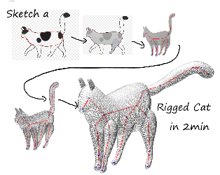

## Demo
We provide an executable software under directory "demo_exe/".


## Let's create a rigged cat!
### 1. Split View: 2D View (left window), 3D View (right window)
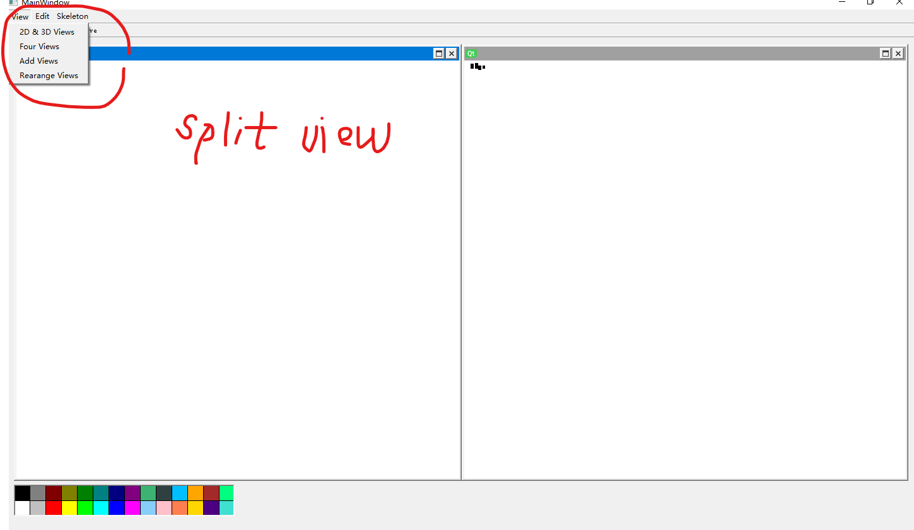

### 2. Open Image: Ctrl+O (demo_exe/image/cat.png)
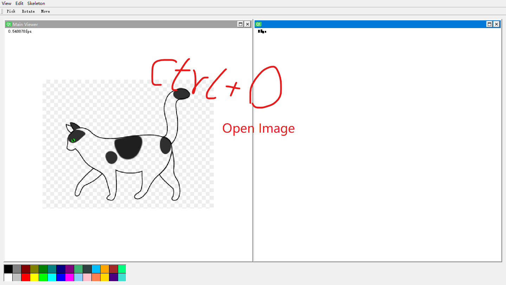

### 3. Sketch a torso
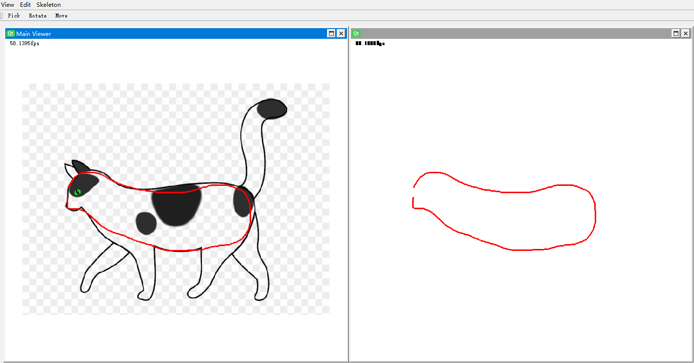

### 4. Adjust Contour
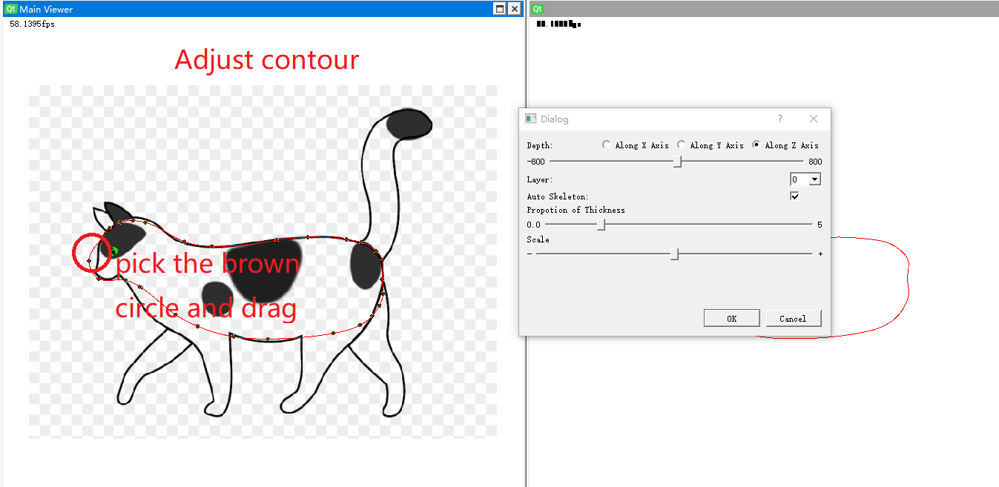

### 5. Parameter in the pop-up window
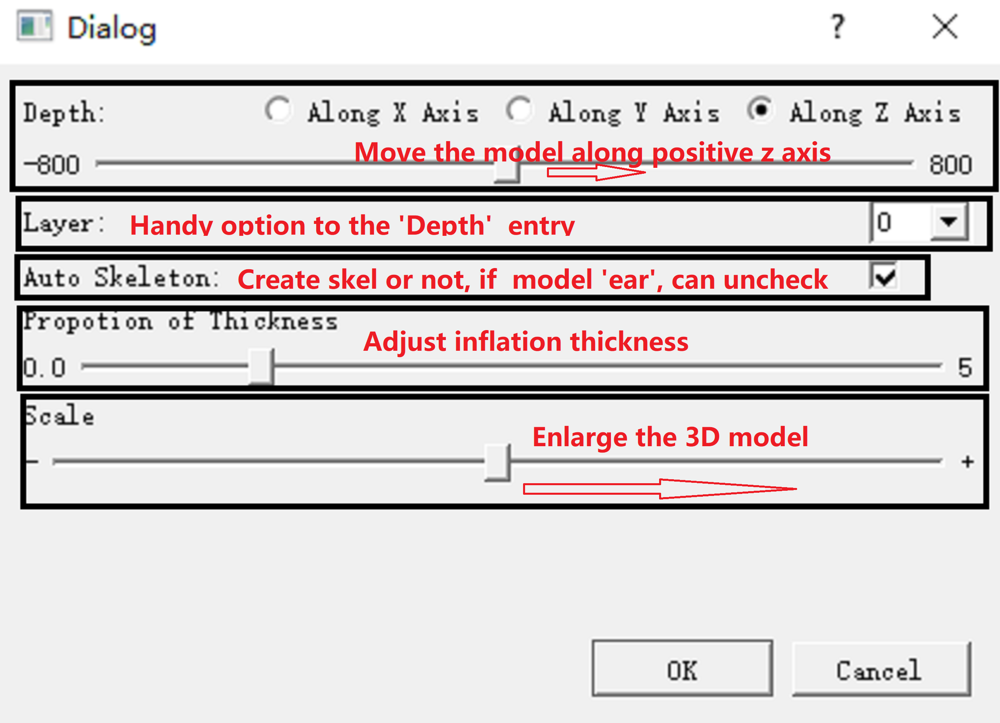

### 6. Create a leg in front of the torso
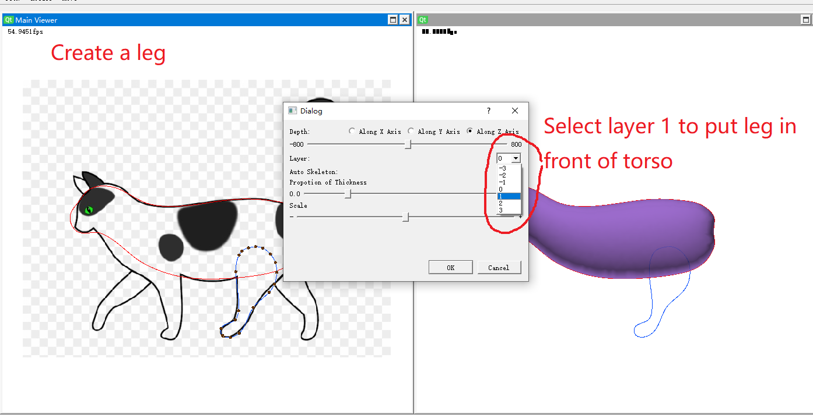

### 7. Create a symmetric leg behind the torso
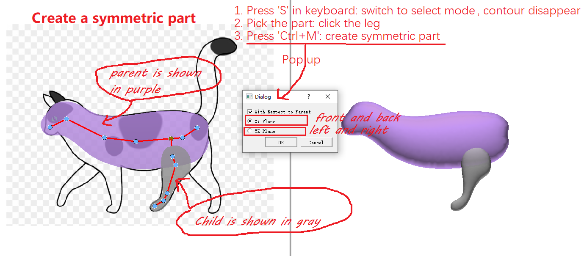

### 8. View symmetric part


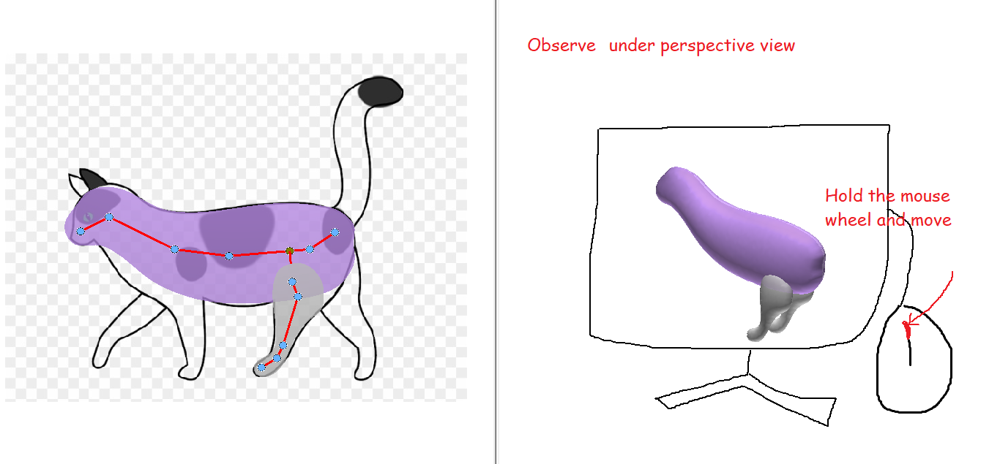

### 9. Create another part: press 'Space' in keybord: switch to 'Sketch Mode', you will see the colorful contour, then sketch, follow step 3-5
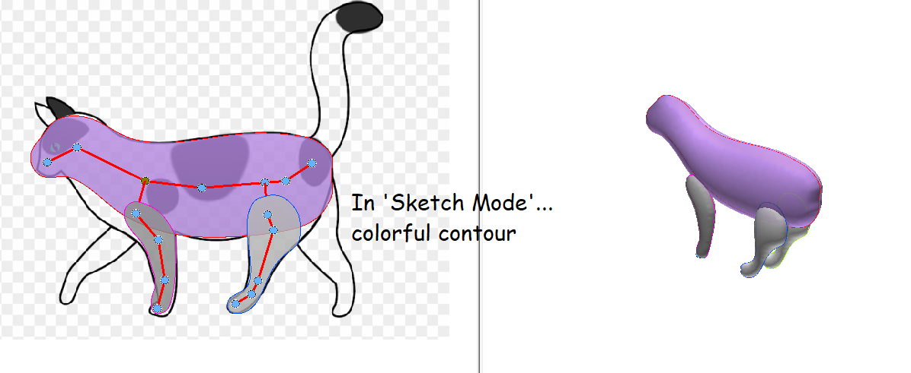
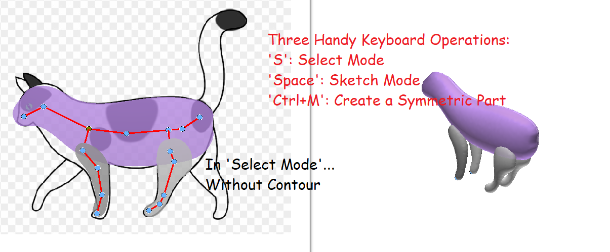
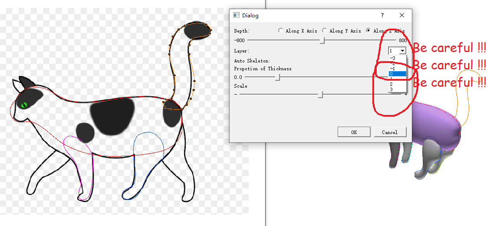


### 10. Create ear

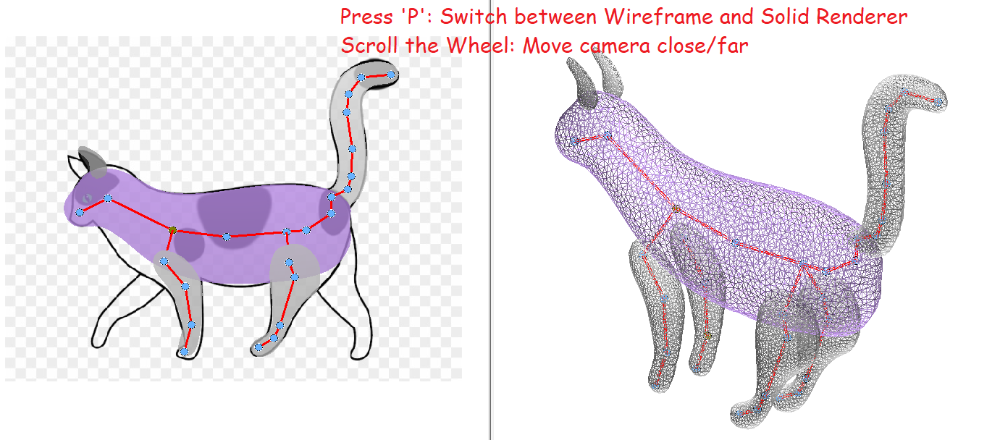

### 11. Refine the skeleton
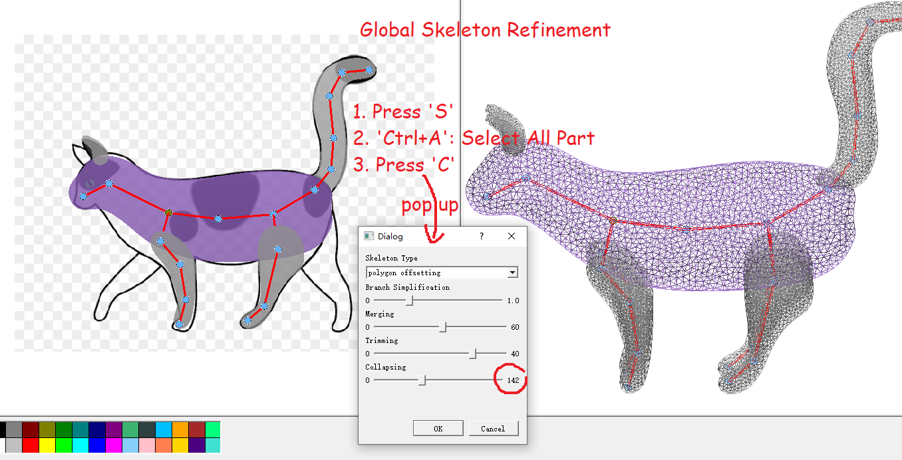

### 12. Finally!
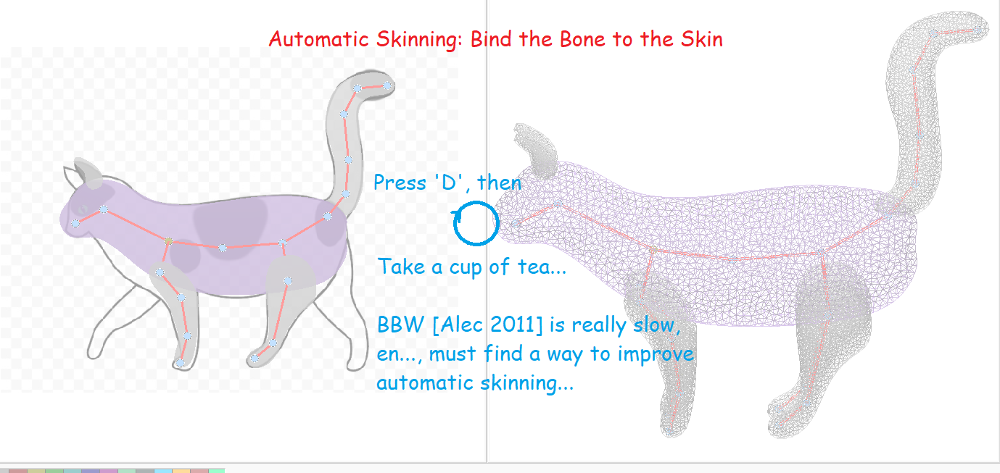
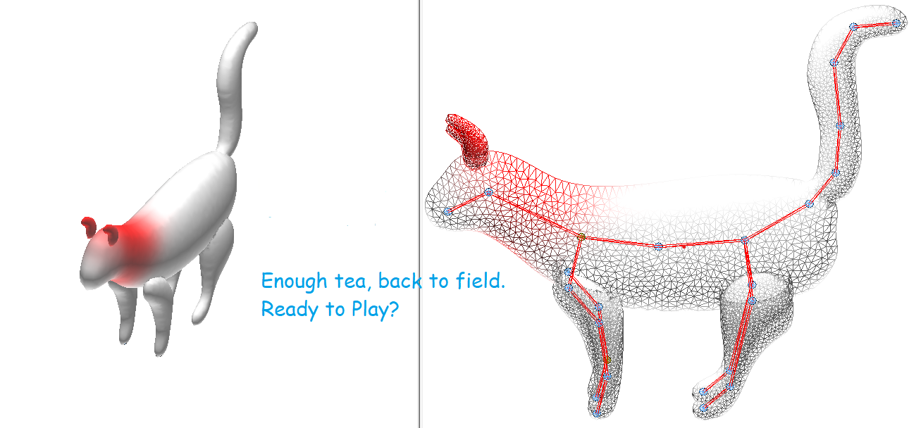


Pick a joint, and hold the left-mouse-button to move. 
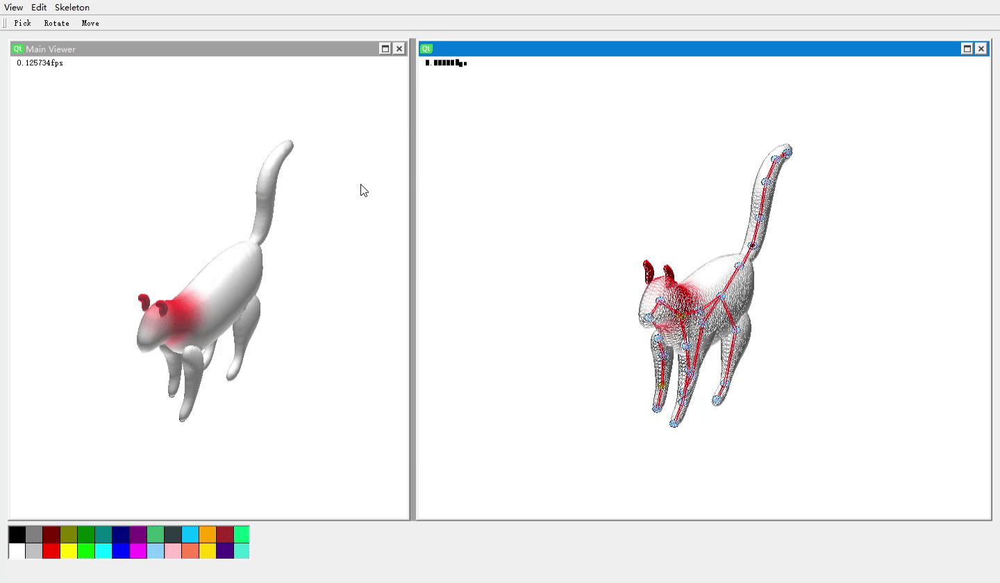
'Dance! Dance! Dance!', too naive, too simple, the LBS deformation. Have to improve later on...

## Tested Environment
1. Ubuntu20.04 LTS, gcc-7 compiler
2. Windows10, Visual Studio Community 2017/2019 x86_amd64 compiler

## Prerequisites 
### Ubuntu20.04 LTS
1. `cmake`: https://cmake.org/
2. `VS Code` (Optional but Highly Recommended): https://code.visualstudio.com/docs/cpp/cmake-linux

### Windows10
1. `Visual Studio 2017/2019`
2. `git`: https://git-scm.com/
3. `cmake`: https://cmake.org/
4. `VS Code` (Optional but Highly Recommended): https://code.visualstudio.com/docs/cpp/cmake-linux

## Dependencies
Qt, OpenCV, Boost, Libigl(Tetgen, Triangle, CGAL, Eigen)
Please install Qt, OpenCV, Boost first, and modify the CMakeLists.txt according to your library's install path.
### Ubuntu20.04 LTS
#### (1) Install Qt 5.12.2 
1. Download `qt-opensource-linux-x64-5.12.2.run` from https://download.qt.io/archive/qt/5.12/5.12.2/, click `.run` to install
#### (2) Install OpenCV
```
sudo apt-get install libopencv-dev
```
#### (3) Install Boost
```
sudo apt-get install libboost-all-dev
```

### Windows10
#### (1) Install Qt 5.12.2 
1. Download `qt-opensource-windows-x86-5.12.2.exe` from https://download.qt.io/archive/qt/5.12/5.12.2/, click `.exe` to install, then select `MSVC 2017 64-bit`
#### (2) Install OpenCV
1. Download OpenCV source code from https://github.com/opencv/opencv/archive/4.2.0.zip
2. CMake Configure:

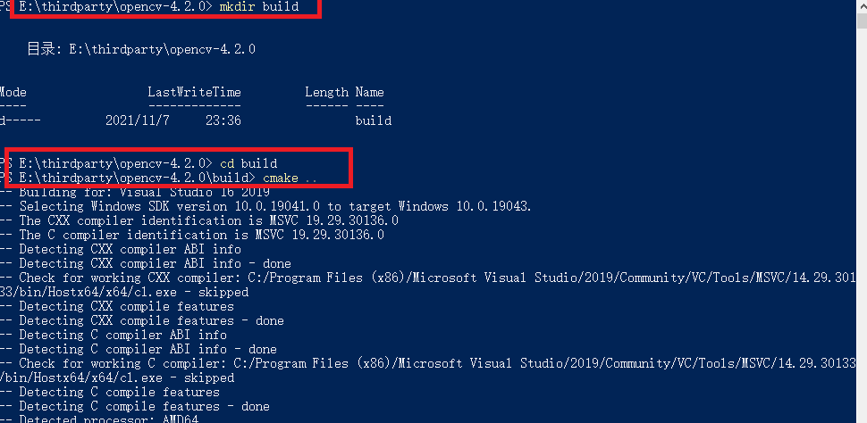

3. Build and Install: 1. open `OpenCV.sln` under `build` directory with VS2017/VS2019. 2. Select `build type` as `Release` and `Build solution`. 3.  goto `CMakeTargets/INSTALL` and `Build`

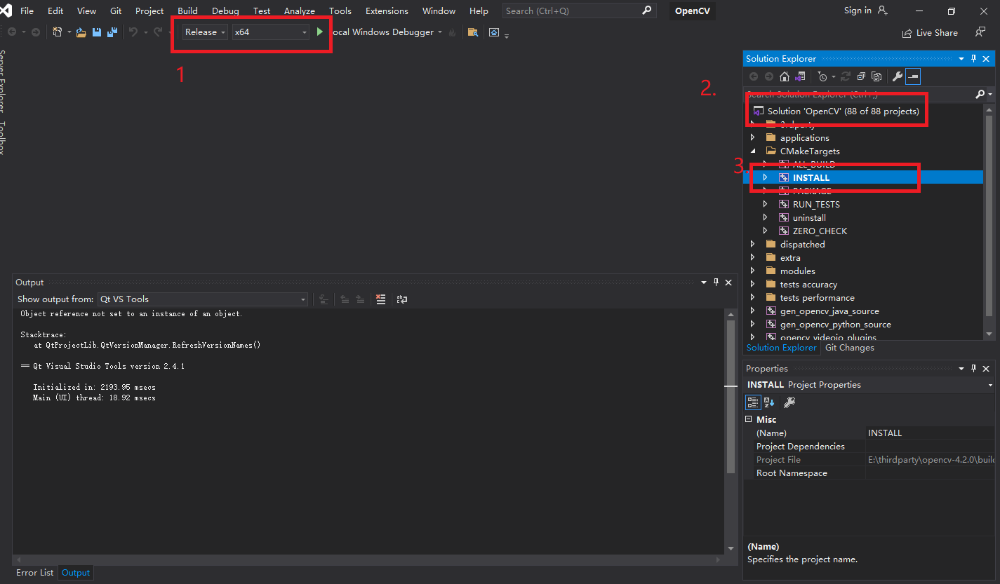


#### (3) Install Boost
https://sourceforge.net/projects/boost/files/boost-binaries/1.74.0/, select suitable versions to download (`boost_1_74_0-msvc-14.2-64.exe` for VS2019, `boost_1_74_0-msvc-14.1-64.exe` for VS2017), click `.exe` to install

## Compile & Run

### For Linux Users, type in the following commands:
```
mkdir build
cd build
cmake ..
make -j8
./main
```
### For Windows Users
It's highly recommended using `VS Code` and `cmake tools from 'VS code' market place` to compile the source code.

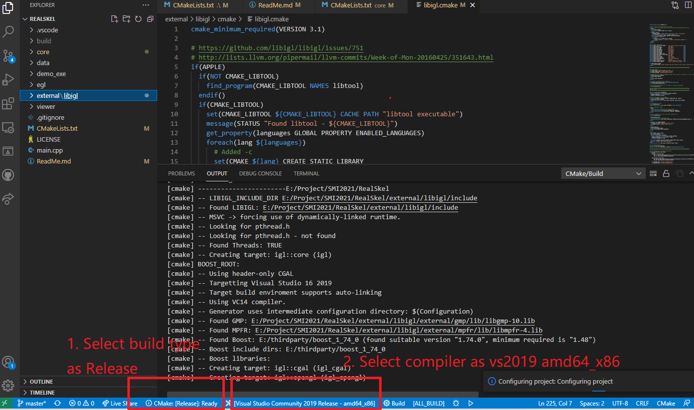

1. Select the `build type` as `Realse`
2. Select a compiler:  `Ctrl+Shift+P`, type in `CMake: Select a Kit`, select a compiler (eg. `Visual Studio Community 2017 x86_amd64` or `Visual Studio Community 2019 x86_amd64`)
3. CMake Configuration: `Ctrl+Shift+P`, type in `CMake Configure`. The configuration process will automatically download all dependencies of libigl. Wait until `CMake Configuration` successfully finishes.

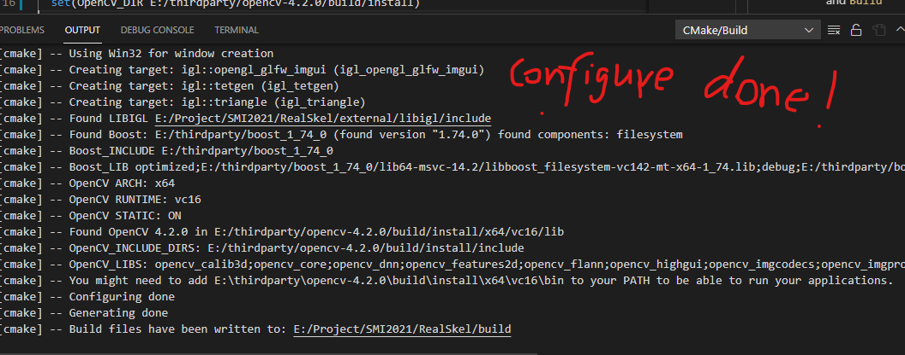

4. Build the solution:  you will find `RealSkel.sln` under directory `build/`，
open `.sln` with Visual Studio 2017/2019, switch to `Release Mode`, and `Build Solution`.  


5. Run the program: copy all `*.dll` and directory `platforms/` from `demo_exe` to your `build/Release/` directory. Click `main.exe`, then you can run the program.

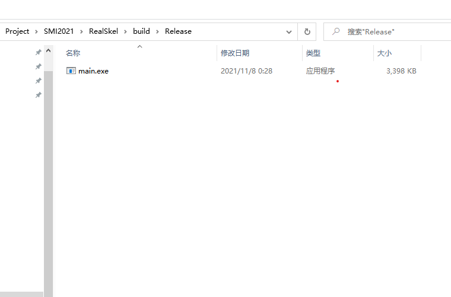
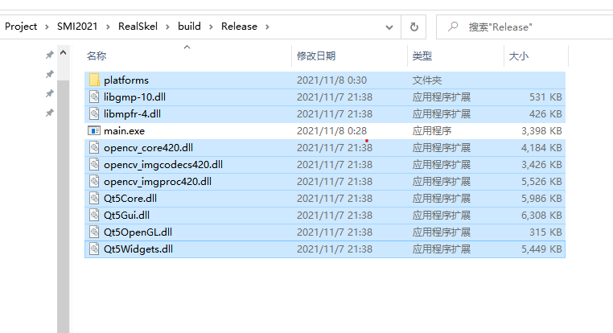

## Other Issues
### Adapt to CGAL
goto `external\libigl\external\cgal\Surface_mesh\include\CGAL\Surface_mesh\Surface_mesh.h`, add the following code in `Class SM_Index`
```cpp
size_type idx()const{return idx_;}
```
You should get something like this
```cpp
class SM_Index
{
// ... 
    size_type idx()const{return idx_;}
// ...
};
```

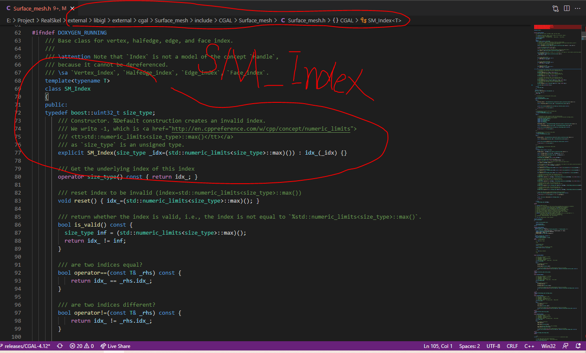


### The lazy way
You can also replace the file `external\libigl\external\cgal\Surface_mesh\include\CGAL\Surface_mesh\Surface_mesh.h' with  [Surface_mesh.h](data/Surface_mesh.h) .


## More Demos
